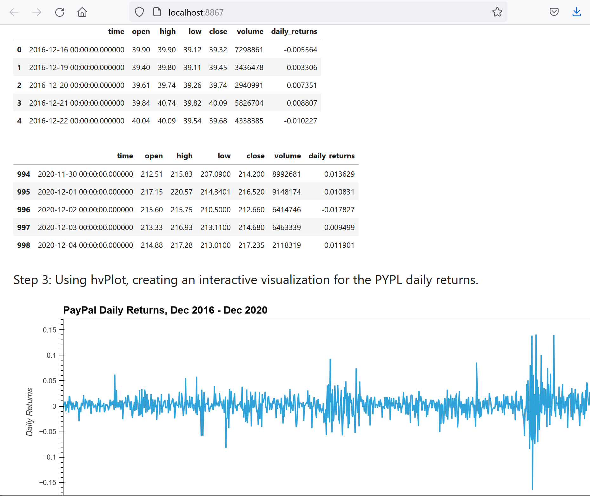
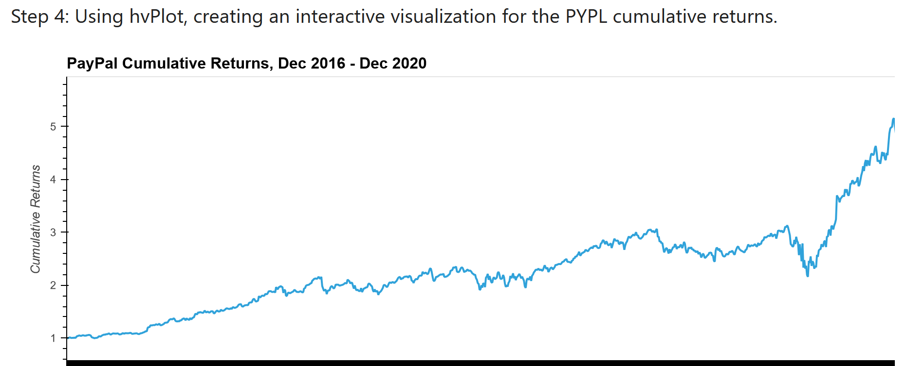
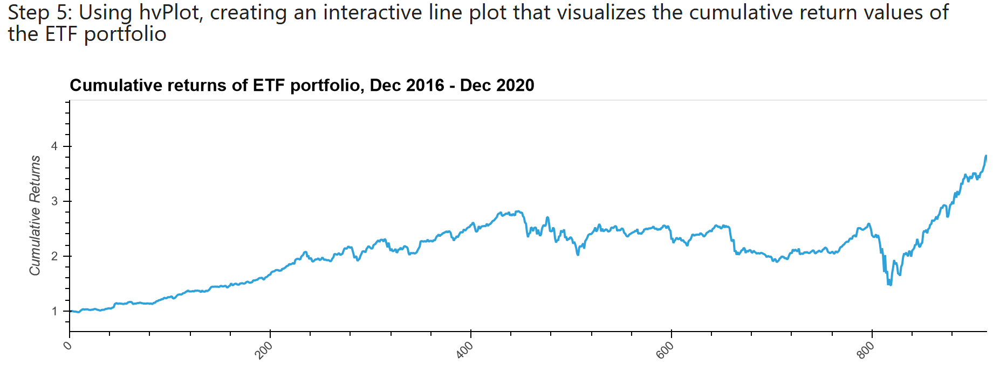

# ETF_Analyzer

The main goal of this project is to build a financial database and web application by using SQL, Python, and the Voila library to analyze the performance of a hypothetical fintech ETF.

---

## Technologies

For this project we use Jupyter notebook in PyViz ecosystem for making visualizations in Python.


* [JupyterLab](https://github.com/jupyterlab/jupyterlab) - an extensible environment for interactive and reproducible computing, based on the Jupyter Notebook and Architecture

* [pandas](https://github.com/pandas-dev/pandas) - is a Python package that provides fast, flexible, and expressive data structures designed to make working with "relational" or "labeled" data both easy and intuitive 

* [hvplot](https://hvplot.holoviz.org/) - hvPlot provides an alternative for the static plotting API provided by Pandas and other libraries

* [PyViz](https://towardsdatascience.com/pyviz-simplifying-the-data-visualisation-process-in-python-1b6d2cb728f1) - a coordinated effort to make data visualization in Python easier to use

* [Python - sqlalchemy](https://www.sqlalchemy.org/) - a library that facilitates the communication between Python programs and databases

* [Viola libraries](https://analyticsindiamag.com/complete-guide-to-voila-to-turn-a-jupyter-notebook-into-a-standalone-web-application/) - open-source python library that is used to turn the jupyter notebook into a standalone web application

---

In this application we are analyzing a single asset - PayPal's Daily Returns:
 


as well as PyaPal's Cumulative Returns:



The analysis ends with vizualization of Cumulative returns of the ETF portfolio




## Instalation Guide

Before opening the Jupyter notebook, you need to install:

```python
pip install SQLAlchemy
```

```python
pip install -c conda-forge viola
```

---

## Contributors

Author: Magdalena Svimberska
email: magdalena.svimberska@gmail.com

---

## License

GNU General Public License